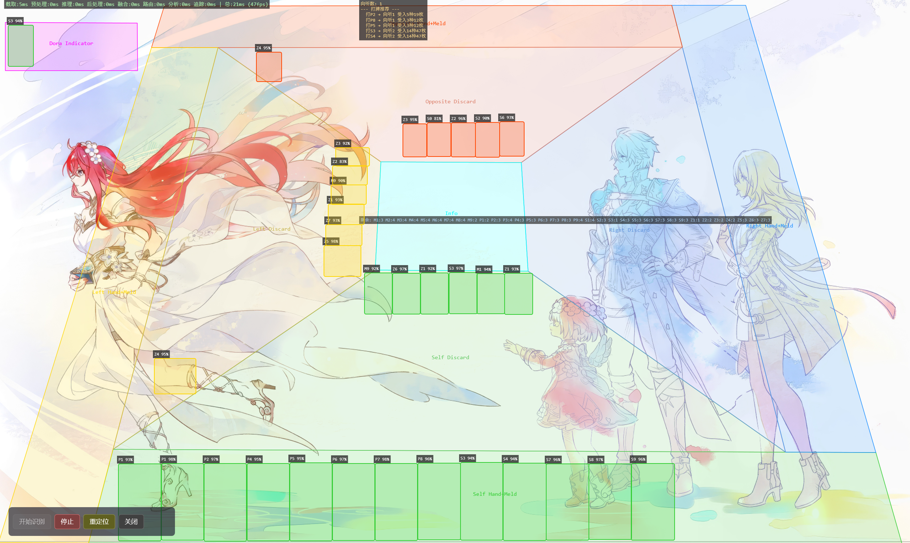

# Mahjong Tool — 日麻 AI 辅助工具集

基于 .NET 10 + ONNX Runtime 的实时日麻对局分析项目，覆盖 **模型训练 → 数据标注 → 屏幕识别 → 对局状态追踪 → AI 决策** 完整链路。

## 项目结构

```
mahjong_tool/
├── TileMind/                # 主程序 (.NET 10, C#)
│   ├── TileMind.Common/     #   共享模型、配置、工具类
│   ├── TileMind.Algorithm/  #   RiichiSharp 适配层（牌型分析）
│   ├── TileMind.Core/       #   DI 注册、静态分析、对局状态追踪、动作分类
│   ├── TileMind.Vision/     #   DXGI 屏幕捕获、YOLOv8 ONNX 推理、多帧融合、显示器枚举
│   ├── TileMind.AI/         #   AI 决策（占位）
│   ├── TileMind.UI/         #   WPF 桌面应用、透明叠加层、区域标定工具、设置页面
│   ├── TileMind.Console/    #   控制台测试入口
│   └── Dependency/          #   原生依赖（cuDNN 等）
│
├── train.py                 # YOLOv8 模型训练脚本
├── export_csharp.py         # 导出 ONNX 模型供 TileMind 推理
├── export_label.py          # 标注数据导出/转换
├── testenv.py               # 训练环境验证
│
├── mahjong_dataset/         # [本地] 训练数据集（图片 + YOLO 标注）
├── mahjong_model/           # [本地] 训练实验输出与 ONNX 模型
├── mahjong_env/             # [本地] Python venv 训练环境
├── X-AnyLabeling/           # [本地] 标注工具（基于 X-AnyLabeling）
├── runs/                    # [本地] YOLO 训练运行日志
└── *.pt                     # [本地] YOLOv8 模型权重 (n/s/m)
```

## TileMind 主程序

详见 **[TileMind/README.md](./TileMind/README.md)**，完整文档包含：

- **架构概览** — 7 个项目分层设计（Common → Vision / Core / AI / Algorithm → UI）
- **核心流程** — 屏幕捕获 → YOLOv8 推理 → 多帧融合 → 区域路由 → 静态分析 → 牌型分析 → [可选] 状态追踪 → 叠加层显示
- **静态分析** — 手牌/副露分离、副露类型判定、暗杠推断、宝牌映射、立直检测
- **牌型分析** — 基于 [RiichiSharp](https://github.com/zzijin/RiichiSharp)：向听数、听牌判定、打牌推荐、胡牌得点、牌剩余统计
- **显示器管理** — SharpDX 枚举所有适配器/输出，支持截取屏与覆盖屏分离配置、跨屏坐标映射
- **覆盖层显示** — 识别框、区域标记、耗时统计、牌型分析、牌剩余，各显示项位置可配置
- **区域标定** — ScreenSplitter 四边形拖拽工具，Ratio 坐标持久化、重定位、恢复默认
- **构建与运行** — 环境要求、构建命令、配置文件说明

### 基础识别与覆盖层绘制


### 静态分析与牌型分析



### 分屏功能

截取屏与覆盖屏可配置为不同显示器，覆盖层自动完成坐标映射，在主屏游戏时副屏同步显示识别结果。

<table><tr><td></td><td></td></tr></table>

## 模型训练

### 识别类型（37 类）

| 牌种 | 编号 |
|------|------|
| 万子 | 1m–9m, 0m（赤五万） |
| 索子 | 1s–9s, 0s（赤五索） |
| 筒子 | 1p–9p, 0p（赤五筒） |
| 字牌 | 1z–7z（东南西北白发中） |

## 开发状态

| 模块 | 状态 |
|------|------|
| TileMind.Common（数据模型、配置、显示器信息） | ✅ 完成 |
| TileMind.Vision（屏幕捕获、YOLO 推理、多帧融合、显示器枚举） | ✅ 完成 |
| TileMind.Algorithm（RiichiSharp 适配、牌型分析） | ✅ 已集成 |
| TileMind.Core（DI、静态分析、状态追踪、动作分类） | ✅ 架构就绪 |
| TileMind.UI（WPF 框架、Overlay 绘制、区域标定、跨屏映射） | ✅ 覆盖层已验证 |
| TileMind.AI（牌效分析、防守判断） | ⏳ 占位 |
| 宝牌映射 | ✅ 完成 |
| 立直检测（静态） | ✅ 完成 |
| 牌型分析（向听/听牌/得点） | ✅ 已集成 |
| 显示器管理（枚举、跨屏映射、窗口定位） | ✅ 完成 |
| 静态分析+状态追踪调优 | 🔧 进行中 |
| 多操作帧分析 | ⏳ 待实现 |
| 对局记录导出（牌谱格式） | ⏳ 待实现 |
| 单元测试 | ⏳ 待添加 |
